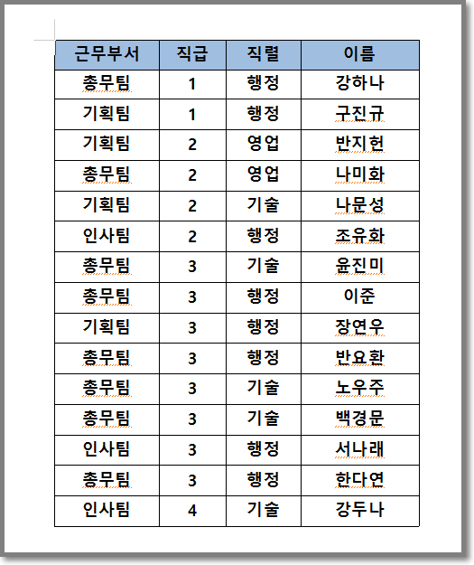
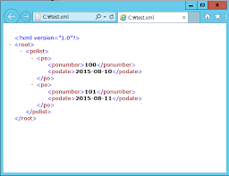
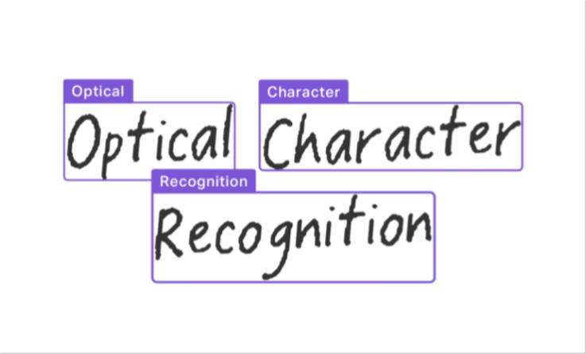

# KoreanOCR
23-2 파이썬기반딥러닝 텀프로젝트

## 1. 프로젝트 개요
### 1.1 프로젝트 목표
- 한글 이미지를 입력받아 한글 텍스트를 출력하는 OCR 모델을 개발한다.

### 1.2 프로젝트 배경
#### 1.2.1 DQA 모델
- 기존 DQA(Document Question Answering) 모델은 문서 시각적 질의 응답(Document Visual Question Answering)이라고도 하는 문서 질의 응답(Document Question Answering)은 문서 이미지에 대한 질문에 답변을 주는 task다.

- 이 task를 지원하는 모델의 입력은 일반적으로 이미지와 질문의 조합이고, 출력은 자연어로 된 답변이다. 이러한 모델은 텍스트, 단어의 위치(바운딩 박스), 이미지 등 다양한 모달리티를 활용한다.
 

- 다만 이러한 모델은 다음 3가지의 문제점을 내포한다.
    1. 표, 이미지로 이루어진 데이터를 인식하지 못한다.
    2. xml등의 형태로 데이터를 가져와도 그 구조가 깨지며 데이터의 소실로 이루어진다. 
    3. 한글 호환성이 떨어진다.
    

    
    
    

#### 1.2.2 한글 OCR
- 상기 문제점의 일부를 한글 OCR을 통해 해결할 수 있다. 
- OCR(Optical Character Recognition)은 광학 문자 인식으로, 이미지 속의 문자를 인식하여 텍스트로 변환하는 기술이다.
- 기존 OCR 모델은 영어가 아닌 언어에 대한 인식률이 낮았고. 표 등의 이미지를 비교적 잘 인식하지 못하는 문제가 있었다.
- 이러한 문제점을 해결하기 위해 한글 OCR 모델을 개발하고자 한다.

## 2. 프로젝트 설계
### 2.1 프로젝트 구조
- 프로젝트는 크게 3가지의 모듈로 구성된다.
    1. 한글 OCR 모델
    2. 한글 OCR 모델을 통한 텍스트 추출
    3. 텍스트 추출을 통한 문서 질의 응답
  
### 2.2 한글 OCR 모델
- 한글 OCR 모델은 다음과 같은 구조로 이루어진다.
    1. 이미지 전처리
    2. 이미지 감지 : Text Detection
    

 

    3. 이미지 인식 : Text Recognition
    

 

    4. 성능 평가
    