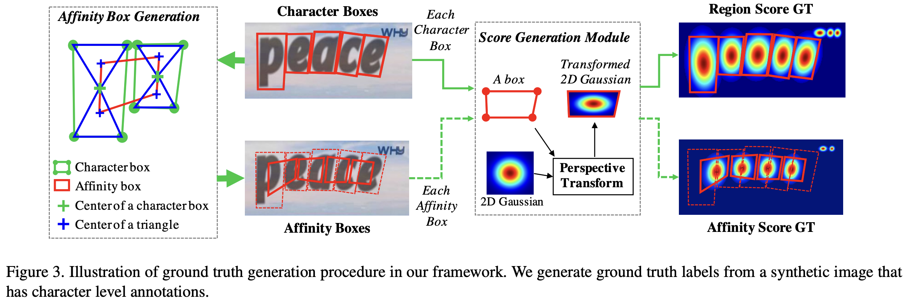
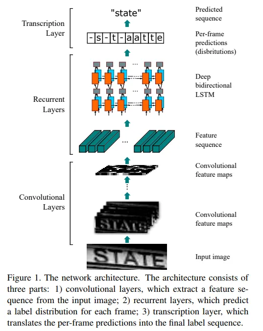

# KoreanOCR
23-2 파이썬기반딥러닝 텀프로젝트

## 1. 프로젝트 개요
### 1.1 프로젝트 목표
- 한글 이미지를 입력받아 한글 텍스트를 출력하는 OCR 모델을 개발한다.

### 1.2 프로젝트 배경
#### 1.2.1 DQA 모델
- 기존 DQA(Document Question Answering) 모델은 문서 시각적 질의 응답(Document Visual Question Answering)이라고도 하는 문서 질의 응답(Document Question Answering)은 문서 이미지에 대한 질문에 답변을 주는 task다.


- 이 task를 지원하는 모델의 입력은 일반적으로 이미지와 질문의 조합이고, 출력은 자연어로 된 답변이다. 이러한 모델은 텍스트, 단어의 위치(바운딩 박스), 이미지 등 다양한 모달리티를 활용한다.
 

- 다만 이러한 모델은 다음 3가지의 문제점을 내포한다.
    1. 표, 이미지로 이루어진 데이터를 인식하지 못한다.
    2. xml등의 형태로 데이터를 가져와도 그 구조가 깨지며 데이터의 소실로 이루어진다. 
    3. 한글 호환성이 떨어진다.
    <div><center>
    
    
    </center></div>

#### 1.2.2 한글 OCR
- 상기 문제점의 일부를 한글 OCR을 통해 해결할 수 있다. 
- OCR(Optical Character Recognition)은 광학 문자 인식으로, 이미지 속의 문자를 인식하여 텍스트로 변환하는 기술이다.
- 기존 OCR 모델은 영어가 아닌 언어에 대한 인식률이 낮았고. 표 등의 이미지를 비교적 잘 인식하지 못하는 문제가 있었다.
- 이러한 문제점을 해결하기 위해 한글 OCR 모델을 개발하고자 한다.

#### 1.2.3 데이터셋 
- 한글 OCR 모델을 개발하고 학습시키기 위해서는 한글 데이터셋이 필요하다.
- 본 프로젝트에서는 <a href = "https://aihub.or.kr/aihubdata/data/view.do?currMenu=115&topMenu=100&aihubDataSe=realm&dataSetSn=81" > 한국어 글자체 이미지</a>를 사용한다. 
- 현대 한글 11,172자를 사용한 폰트 50종의 글자체와 성별, 연령층 별로 직접 제작한 이미지 파일 구축 및 간판, 상표, 교통 표지판 등의 한글이 포함된 이미지 10만 장을 구축한 이미지 데이터를 제공한다.
   구축내용
    - 현대 한글 글자체 데이터셋 : 현대 한글 문자 11,172자에 대한 인쇄체 및 손글씨체 500만자, text in the wild 10만장
    - 현대한글, 국립국어원의 한국인이 가장 많이 쓰는 단어 6천자, 뉴스 기반 문장 등으로 작성한 글자
    - 간판, 표지판, 상표, 도서표지 등 text in the wild는 직접 촬영한 이미지를 사용
- 본 프로젝트에서는 이중 현대 한글 글자체 데이터셋을 이용하려 한다. 본 프로젝트의 목적성이 문서 ocr을 통한 DQA 모델 성능향상을 목적으로 하기 때문이다.


## 2. 프로젝트 설계
### 2.1 프로젝트 구조
- 프로젝트는 크게 3가지의 모듈로 구성된다.
    1. 한글 OCR 모델
    2. 한글 OCR 모델을 통한 텍스트 추출
    3. 텍스트 추출을 통한 문서 질의 응답
  
### 2.2 한글 OCR 모델
- 한글 OCR 모델은 다음과 같은 구조로 이루어진다.
    1. 데이터 전처리
    2. 이미지 감지 : Text Detection
    <div><center> </center></div> 
    3. 이미지 인식 : Text Recognition
    <div><center> </center></div>
    4. 성능 평가

#### 2.2.1 데이터 전처리
- 데이터 전처리는 이미지를 모델에 입력하기 위해 필요한 전처리 과정이다.
- 다음과 같은 처리를 통해 text-detection과 text-recognition성능을 높일 수 있다. 
  1. 이미지 크기 조정
  2. 이미지 색상 조정(흑백)
  3. 이미지 normalization : 이미지의 픽셀값을 0~1 사이의 값으로 조정
  4. 이미지 augmentation : 이미지를 회전, 이동, 확대, 축소 등의 변형을 주어 데이터의 양을 늘린다.
  5. 이미지 노이즈 추가 : 이미지에 노이즈를 추가하여 모델의 학습을 돕는다.

#### 2.2.2 이미지 감지 : Text Detection
- 이미지 감지는 이미지 속의 문자를 인식하는 과정이다.
- 본 프로젝트에서는 CRAFT 모델을 사용한다.
- CRAFT 모델은 VGG16_bn을 기반으로 제작되어 있으며 2.2.1의 데이터 전처리 과정을 포함한다.
    <div><center> </center></div>

- CRAFT 모델을 사용하기 위해서는 다음과 같은 과정을 거쳐야한다.
  1. CRAFT 모델을 다운로드한다.
      ```
      git clone https://github.com/clovaai/CRAFT-pytorch.git
      ```
  
  2. CRAFT 모델의 요구 사항을 설치한다. 단 이때 버전을 맞출 수 없는 경우, 모두 최신버전으로 설치하고 다음 2.1을 진행한다.
    ```
    pip install -r requirements.txt
    ```
    2.1 torch버전에 따른 error 해결 1
  - 높은 torch 버전을 사용하는 경우, model_url과 같은 오류가 발생한다. 이를 해결하기 위해 다음과 같은 과정을 거친다.
  - torch.models.vgg.py에 다음과 같은 코드를 추가한다. 
  - <a href =https://github.com/clovaai/CRAFT-pytorch/issues/191> 참고 </a>
    
    ```
     model_urls = {
        'vgg16': 'https://download.pytorch.org/models/vgg16-397923af.pth',
        'vgg16_bn': 'https://download.pytorch.org/models/vgg16_bn-6c64b313.pth',
  
    ```
    2.2 torch버전에 따른 error 해결 2
  - CRAFT 모델에서 사용하는 model.VGG16_BN(pretrained=False)과 같은 코드의 pretrained는 높은 버전의 토치에서는 사용할 수 없다.
  - CRAFT-pytorch/basenet/vgg16_bn.py와 /craft.py에 pretrained를 지우고 weights='VGG16_BN_Weights.DEFAULT'를 사용하면 해결된다.
  - <a href = "https://github.com/JaidedAI/EasyOCR/issues/766">참고</a>
  
  3. CRAFT 사전 학습 모델을 <a href = "https://drive.google.com/open?id=1Jk4eGD7crsqCCg9C9VjCLkMN3ze8kutZ">다운로드</a>받아서 CRAFT-pytorch/model 폴더에 넣는다.
  4. 다음 명령어를 통해 CRAFT 모델을 실행 시킬 수 있다. 
    ```
   !python ./CRAFT-pytorch/test.py --trained_model={model_path} --test_folder={test_folder} --cuda=True
   ```
  5. CRAFT 모델의 결과는 './result' 폴더에 저장된다.   

#### 2.2.3 이미지 인식 : Text Recognition
- 이미지 인식은 이미지 속의 문자를 인식하는 과정이다.
- 본 프로젝트에서는 CRNN 모델을 사용한다.
- CRNN 모델은 CNN과 RNN을 결합한 모델로, CNN을 통해 이미지의 특징을 추출하고 RNN을 통해 문자를 인식한다.
- CRNN 모델은 다음과 같은 구조를 가진다.
<div><center> </center></div>
- CRNN 모델은 다음과 같이 동작한다. 
  1. CNN을 통해 이미지의 특징을 추출한다.
  2. 추출한 feature sequence들을 RNN에 input으로 하여 이미지의 텍스트 시퀀스를 예측한다.
  3. 예측한 텍스트 시퀀스를 통해 이미지를 텍스트로 변환한다. 출처 : <a href = https://arxiv.org/abs/1507.05717 >https://arxiv.org/abs/1507.05717</a>

- 본 프로젝트에서는 성능 향상을 위해 CNN에 ResNet을 사용한다.
- loss function으로는 CTC loss를 사용한다.
- CTC (Connectionist Temporal Classification) loss는 음성 인식 및 문자 인식과 같은 sequential 데이터의 학습에서 사용되는 손실 함수다. 이 손실 함수는 입력 sequence와 출력 sequence 간의 매핑을 학습하는 데 사용된다. 특히, 시퀀셜한 입력 데이터와 해당 시퀀스에 대한 라벨이 있는 경우에 유용하다.
- CTC loss의 목표는 네트워크가 입력 시퀀스로부터 출력 시퀀스를 생성하는 데 있어서 정렬이나 정확한 위치 정보 없이 학습할 수 있도록 하는 것이다. 이는 출력 시퀀스의 길이가 입력 시퀀스의 길이보다 짧을 수 있고, 중복이나 간격을 두고 등장할 수 있기 때문이다.

#### 2.2.4 성능 평가
- detection의 경우 dataset의 bounding box와 모델의 bounding box를 비교하여 성능을 평가한다. 하지만 본 프로젝트에서 사용된 데이터셋에는 bounding box가 없기 때문에 성능 평가를 진행할 수 없다.

## 3.프로젝트 결과, 추후 진행 과제 
- 본 프로젝트에서는 detection 모델을 통한 글자체 data의 bounding box를 추출하는 것에 성공했다. 
- 또한 recognition 모델을 resnet base의 CRNN모델을 제시하였으며, bouding box와 결합되는 모델을 제시한다. 
- 하지만 recognition 모델을 통한 텍스트 추출에 실패했다.
- 이는 최초 목적인 LLM-DQA 모델의 성능향상에 실패했다는 것을 의미한다.
- 성공적인 학습 혹은 성능향상 다음과 같은 시도들이 필요해 보인다.

  1. 더 간단한 모델을 통하여 학습을 진행하고 성능을 평가함으로써 model baseline을 설정한다.
  2. bouding box를 활용하기 위한 transforms를 제시한다.
  3. dataset의 일부만을 사용하였는데, 한글 글자체 데이터셋이 사용하는 text in the wild 데이터 셋 등을 활용하여 더 다양한 상황에서 사용할 수 있는 범용적 모델을 만든다.
  4. 여러 문서를 읽고 이를 텍스트로 변환하는 과정을 진행하고 이를 통해 LLM-DQA 모델의 성능을 평가한다.
  
## 4. reference
- AIHub, “한국어 글자체 이미지”, https://aihub.or.kr/aihubdata/data/view.do?currMenu=115&topMenu=100&aihubDataSe=realm&dataSetSn=81, (2023-12-17)
- GIthub, “Craft-pytorch, model_url issue”, https://github.com/clovaai/CRAFT-pytorch/issues/191, (2023-12-17)
- Github, ”torch.model pretrained error”, https://github.com/JaidedAI/EasyOCR/issues/766, (2023-12-17)
- Shi, Baoguang, Xiang Bai, and Cong Yao. "An end-to-end trainable neural network for image-based sequence recognition and its application to scene text recognition." IEEE transactions on pattern analysis and machine intelligence 39.11 (2016): 2298-2304.aoguang Shi, (2021). An End-to-End Trainable Neural Network for Image-based Sequence Recognition and Its Application to Scene Text Recognition, 


  